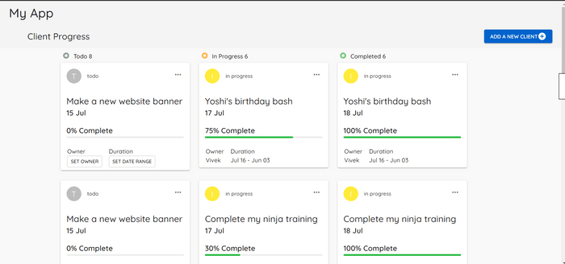
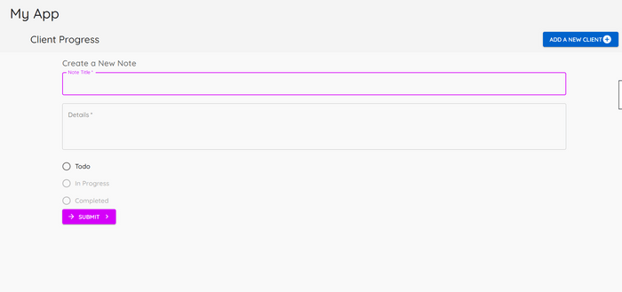

### Developed an App using React.js which can be used to track progress of different  cleints' projects.

Steps needed to start the App:
1) Download the code
2) Run **npm install** to install dependencies before starting the app.
3) The code has three local data JSON files.

  Run : **json-server --watch data/todos.json --port 8001**
  
  Run : **json-server --watch data/inprogress.json --port 8002**
  
  Run : **json-server --watch data/completed.json --port 8003**

4) Run **npm start**

Functionalities implemented in the App:

-> This platform contains a dashboard where we can track the different phases in which customers are.
-> There is be an option to add a new client.
-> After adding a new client, the card is added in the Todo cards list.
-> Cards show only the high level information yet useful on the dashboard.
Further, individual cards defined for each client are clickable and on clicking a card, a dialog box will pop up, that  will show more details about the project.
-> Progress bars show the percentage of the project completed.
-> Three dots on the card depict two options edit and delete. Delete option is functional.

Functionalities yet to be implemented:

Drag and Drop property.

Screenshot of the App

